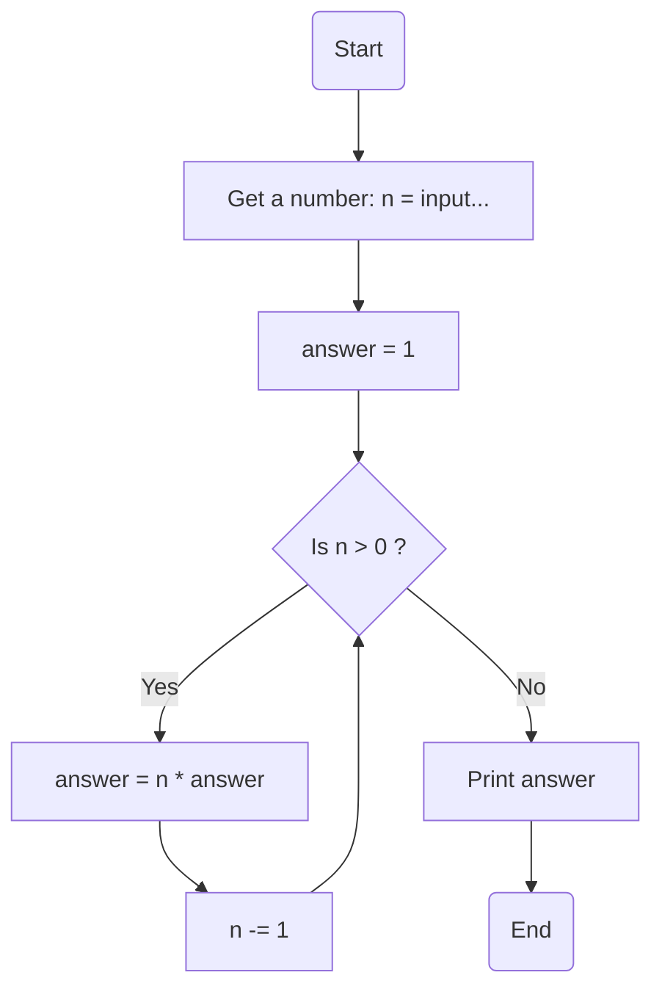

### راهنمای تمرین فاکتوریل

تو این تمرین ازتون خواسته شده که فرمول فاکتوریل رو که تو ریاضی خوندید بصورت برنامه پیاده سازی کنید.

فرمول کلی فاکتوریل:

> n! = (n-1) \* (n-2) \* ... \* 1

برای مثال:

> 4! = 4 \* 3 \* 2 \* 1  
> 85! = 85 \* 84 \* .. \* 3 \* 2 \* 1

### الگوریتم

این یک الگوریتم برای محاسبه فاکتوریل عدد است:

**مقداردهی اولیه n**: عددی که میخاید فاکتوریل اون رو حساب کنید از کاربر بگیرید.  
**مقداردهی اولیه answer**: یک متغیر با مقدار اولیه 1 تعریف می‌شود که در نهایت مقدار فاکتوریل در آن ذخیره خواهد شد.  
**حلقه**: تا زمانی که مقدار n > 0 باشد، مراحل زیر انجام می‌شود:

> مقدار answer در n ضرب میشه.  
> مقدار n رو یکی کم می کنیم.

**توقف**: وقتی مقدار n برابر با صفر شد، حلقه متوقف شده و مقدار نهایی answer برابر با فاکتوریل عدد ورودی خواهد بود.  
**نمایش نتیجه**: مقدار answer چاپ شده و برنامه خاتمه می‌یابد.

### فلوچارت

