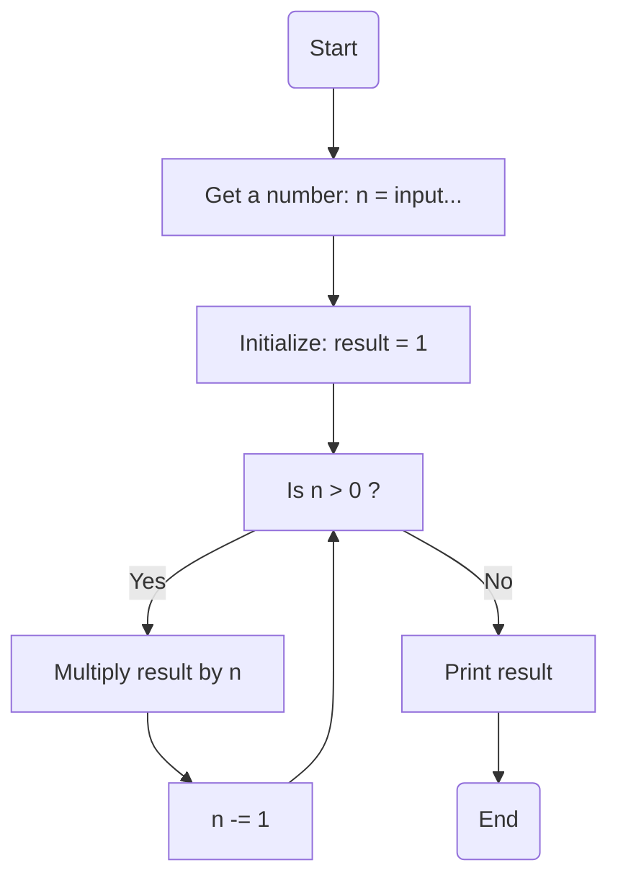

### راهنمای تمرین فاکتوریل

این یک الگوریتم برای محاسبه فاکتوریل عدد است:

**مقداردهی اولیه n**: عددی که می‌خواهید فاکتوریل آن را حساب کنید به عنوان ورودی توسط کاربر تعیین می‌شود.  
**مقداردهی اولیه result**: یک متغیر با مقدار اولیه 1 تعریف می‌شود که در نهایت مقدار فاکتوریل در آن ذخیره خواهد شد.  
**بررسی شرط**: تا زمانی که مقدار n > 0 باشد، مراحل زیر انجام می‌شود:
مقدار result در n ضرب می‌شود.  
مقدار n یک واحد کاهش می‌یابد.  
**توقف**: وقتی مقدار n برابر با صفر شد، حلقه متوقف شده و مقدار نهایی result برابر با فاکتوریل عدد ورودی خواهد بود.  
**نمایش نتیجه**: مقدار result چاپ شده و برنامه خاتمه می‌یابد.

### فلوچارت

