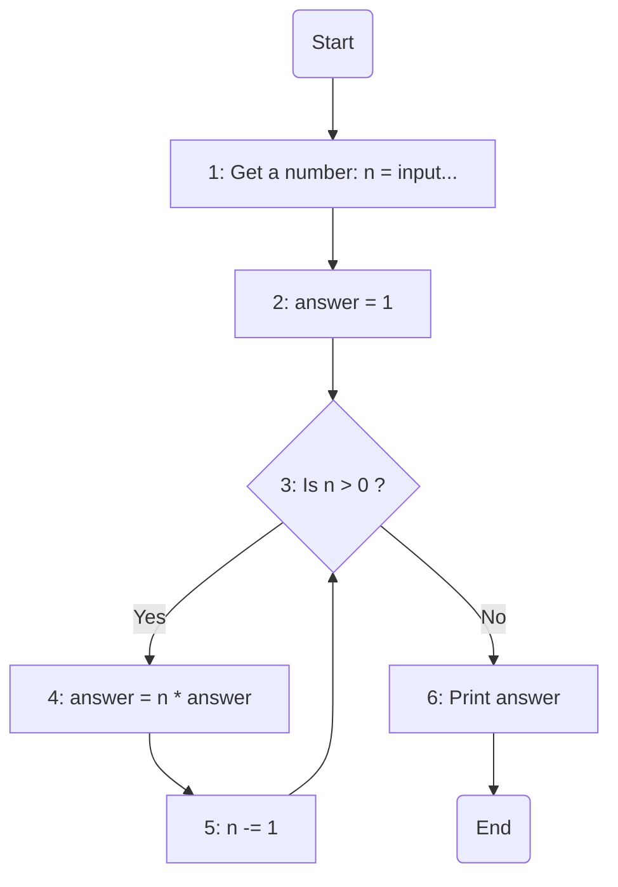

### راهنمای تمرین فاکتوریل

تو این تمرین ازتون خواسته شده که فرمول فاکتوریل رو که تو ریاضی خوندید بصورت برنامه پیاده سازی کنید.

فرمول کلی فاکتوریل:

> n! = n \* (n-1) \* (n-2) \* ... \* 1

برای مثال:

> 4! = 4 \* 3 \* 2 \* 1  
> 85! = 85 \* 84 \* .. \* 3 \* 2 \* 1

### الگوریتم

**مقداردهی اولیه n**: عددی که میخاید فاکتوریل اون رو حساب کنید از کاربر بگیرید.  
**مقداردهی اولیه answer**: یک متغیر به اسم جواب (answer) با مقدار اولیه 1 تعریف میکنیم که جواب نهایی فاکتوریل توش ذخیره میشه.  
**حلقه**: تا وقتی که مقدار n > 0 باشه مراحل زیر انجام میشه:

> مقدار answer در n ضرب میشه.  
> مقدار n رو یکی کم می کنیم.

**توقف**: وقتی مقدار n برابر با صفر شد، حلقه متوقف شده و مقدار نهایی answer برابر با فاکتوریل عدد ورودی خواهد بود.  
**نمایش نتیجه**: مقدار answer چاپ شده و برنامه خاتمه می‌یابد.

### فلوچارت

### تعقیب

برای درک بهتر مساله متغیرها (variables) رو با مثال ۴ فاکتوریل تعقیب میکنیم

| مرحله | `n` | `answer` |
| ----- | --- | -------- |
| Start | `-` | `-`      |
| 1     | `4` | `-`      |
| 2     | `4` | `1`      |
|       |     |          |
| 3     | `4` | `1`      |
| 4     | `4` | `4`      |
| 5     | `3` | `4`      |
|       |     |          |
| 3     | `3` | `4`      |
| 4     | `3` | `12`     |
| 5     | `2` | `12`     |
|       |     |          |
| 3     | `2` | `12`     |
| 4     | `2` | `24`     |
| 5     | `1` | `24`     |
|       |     |          |
| 3     | `1` | `24`     |
| 4     | `1` | `24`     |
| 5     | `0` | `24`     |
|       |     |          |
| 3     | `0` | `24`     |
| 6     | `0` | `24`     |
| End   | `0` | `24`     |
