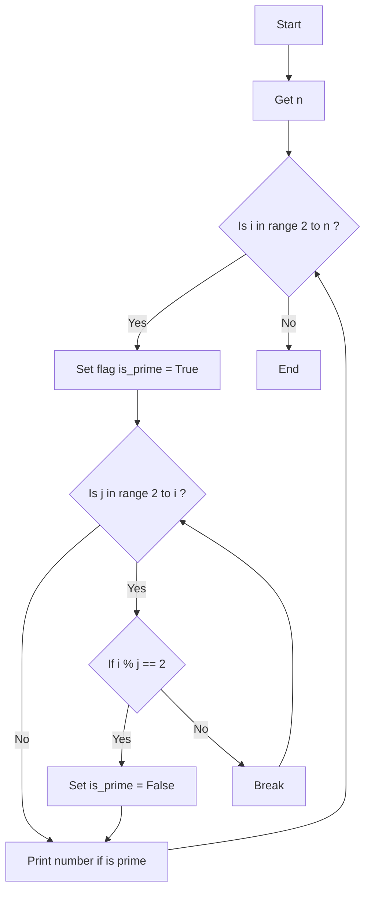

### راهنمای تمرین اعداد اول

این یک فلوچارت برای محاسبه اعداد اول کمتر از عدد n است:

**گرفتن عدد n**: ابتدا عدد n را از کاربر میگیریم

**حلقه بزرگ**: در حلقه بزرگ ما از اعداد ۲ تا n به دنبال هر عدد اول میگردیم

> در اینجا یک پرچم بالا میگیریم به این معنی که ما فکر حدس میزنیم این عدد اول است مگر اینکه خلافش ثابت شود.

> **حلقه کوچک**: در این حلقه میگردیم به دنبال اینکه ببینیم عدد مورد بررسی i بر عددی قبل از خود بخش پذیر است یا خیر؟
>
> > > در صورتی که بخش پذیر نبود به پرچم دست نمیزنیم و ادامه میدهیم  
> > > ولی در صورتی که بخش پذیر بود پرچم را برای همیشه پایین میگیریم و آرزوی ها نقش بر آب شد و این عدد طبق حدس ما عدد اول نبوده!

> **نمایش عدد اول**: در انتها در حلقه بزرگ اعدادی که اول هستند را نمایش می دهیم

### فلوچارت

