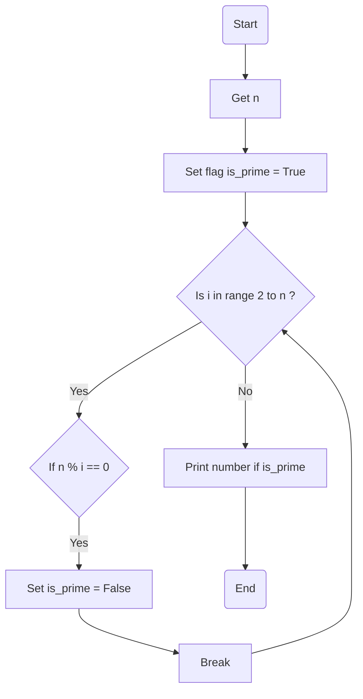

### راهنمای تمرین عدد اول

این یک فلوچارت برای برای فهمیدن این که n عدد اول است:

> **گرفتن عدد n**: ابتدا عدد n رو از کاربر میگیریم

> **حلقه**: در این حلقه میگردیم دنبال اینکه ببینیم عدد مورد بررسی n بر عددی قبل از خودش بخش پذیره یا نه؟
>
> > > در صورتی که بخش پذیر نبود: به پرچم دست نمیزنیم و ادامه میدیم  
> > > ولی در صورتی که بخش پذیر بود: این عدد طبق حدس ما عدد اول نبوده و آرزوهامون نابود شد پس پرچم رو پایین میاریم!

> **نمایش عدد اول**: در انتها توی حلقه بزرگ اعدادی که اول هستند رو نمایش میدیم

### فلوچارت

