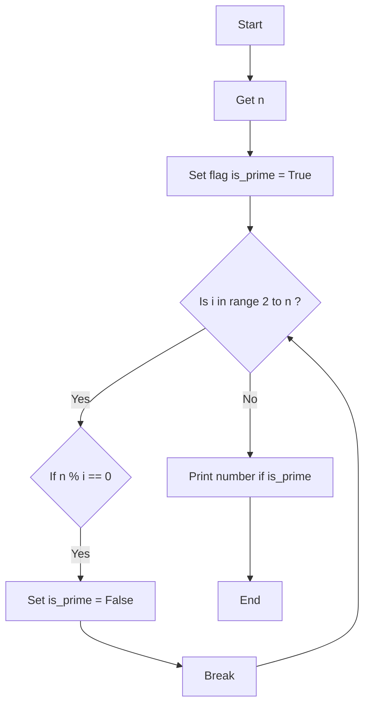

### راهنمای تمرین عدد اول

این یک فلوچارت برای برای فهمیدن این که n عدد اول است:

> **گرفتن عدد n**: ابتدا عدد n را از کاربر میگیریم

> **حلقه**: در این حلقه میگردیم به دنبال اینکه ببینیم عدد مورد بررسی n بر عددی قبل از خود بخش پذیر است یا خیر؟
>
> > > در صورتی که بخش پذیر نبود: به پرچم دست نمیزنیم و ادامه میدهیم  
> > > ولی در صورتی که بخش پذیر بود: پرچم را برای همیشه پایین میگیریم و آرزوی ها نقش بر آب شد و این عدد طبق حدس ما عدد اول نبوده!

> **نمایش عدد اول**: در انتها در حلقه بزرگ اعدادی که اول هستند را نمایش می دهیم

### فلوچارت

