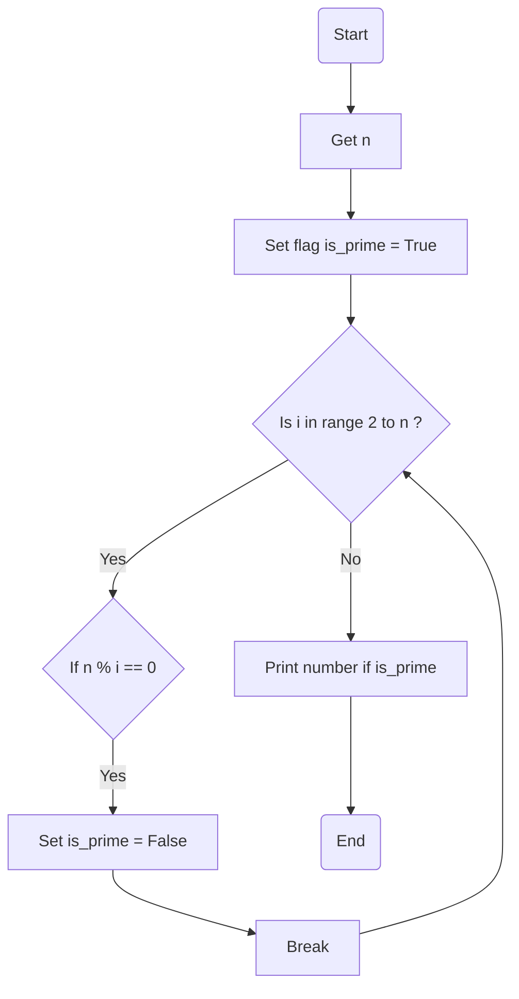

### راهنمای تمرین سری فیبوناچی

دنباله یا سری فیبوناچی به اعدادی میگن که پشت سر هم نوشته میشن و هرعدد جمع دو عدد قبلی خودشه  
برای مثال این یک دنبال فیبوناچی هست که با اعداد 1 و 1 شروع میشه:

> 1 - 1 - 2 - 3 - 5 - 8 - 13 - 21 - ...

> فرض کنید پای چپتون درد میکنه و پای راستتون رو جلو میذارید و پای چپتون رو میکشید جلو  
> با این کار پای راست شما اسمش میشه پای b و پای چپتون میشه اسمش  
> همیشه پای راستتون جلوتر از عقبی هست و پای چپتون همیشه عقب تره  
> وقتی میکشیدش جلو تازه میاد جایی که پای b قبلا بوده

### الگوریتم

شاید الان فحشم بدید ولی بازم! قراره اون عدد n لعنتی رو از کاربر بگیریم  
ولی این بار برای اینه که بهمون بگه چند بار قراره عدد نشون بدیم تا وایسه برنامه  
دو تا عدد شروع کننده رو که همون دوتا یک هستن نامگذاری میکنیم a , b مثلا  
حالا میایم یه مقدار یه حلقه درست میکنیم که n بار کار زیر رو برامون تکرار کنه:

اول مقدار a رو نمایش میدیم  
بعد وقتش میرسه که a رو ببریم جایی که b هست و b رو مساوی a+b کنیم

> اما مشکلی که هست اینه:  
> اگه ما a رو اول تغییر بدیم دیگه چجوری b رو برابر a+b کنیم؟  
> چون a شده b و انگار داریم b رو فقط اینجوری دوبرابر میکنیم (b+b)  
> اگه b رو هم اول تغییر بدیم بکنیم a + b هم بعدش چجوری مقدار قبل b رو که گم شده بریزیم توی a

خبر خوب اینکه پایتون کارمون رو راحت کرده و بهمون اجازه میده بدون دغدغه همزمان تغییرشون بدیم:

> a, b = b, a + b

و تمام... شما با موفقیت دنباله فیبوناچی رو نوشتید

### فلوچارت

