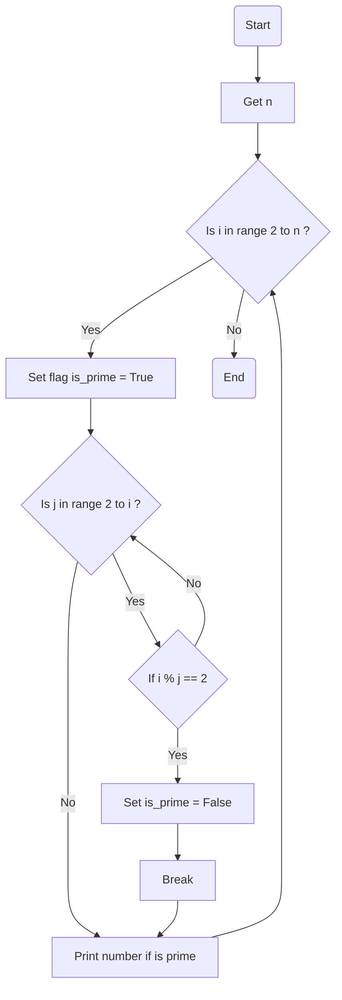

### راهنمای تمرین اعداد اول

این یک الگوریتم برای محاسبه اعداد اول کمتر از عدد n است:

**گرفتن عدد n**: ابتدا عدد n رو از کاربر میگیریم

**حلقه بزرگ**: در حلقه بزرگ ما از اعداد ۲ تا n به دنبال هر عدد اول میگردیم

> در اینجا یک پرچم بالا میگیریم به این معنی که ما حدس میزنیم این عدد اول است مگر اینکه خلافش ثابت شود.

> **حلقه کوچک**: در این حلقه میگردیم به دنبال اینکه ببینیم عدد مورد بررسی i بر عددی قبل از خود بخش پذیره یا نه
>
> > > در صورتی که بخش پذیر نبود به پرچم دست نمیزنیم و ادامه میدیم  
> > > ولی در صورتی که بخش پذیر بود: این عدد طبق حدس ما عدد اول نبوده و آرزوهامون نابود شد پس پرچم رو پایین میاریم!

> **نمایش عدد اول**: در انتها در حلقه بزرگ اعدادی که اول هستند رو نمایش میدیم

### فلوچارت

