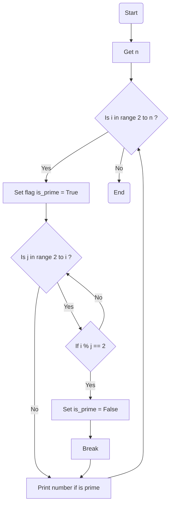

### راهنمای تمرین اعداد اول

این تمرین دقیقا مثل تمرین اعداد اوله با این تفاوت که این بار یه عدد از کاربر میگیریم  
و میگردیم ببینیم چه اعدادی اولی بین صفر تا عددی که از کاربر گرفته شده وجود دارند  
برای این کار ما کد تمرینی که برای فهمیدن یک عدد اول داشتیم رو داخل یه تابع تعریف می کنیم  
بعد با یه حلقه ساده میگردیم میبینیم کودوم عدد ها کمتر از n هستن که که عدد اول هستن  
و فقط همونارو نمایش میدیم...

### الگوریتم

**گرفتن عدد n**: ابتدا عدد n رو از کاربر میگیریم

**حلقه بزرگ**: در حلقه بزرگ ما از اعداد ۲ تا n به دنبال هر عدد اول میگردیم

> در اینجا یک پرچم بالا میگیریم به این معنی که ما حدس میزنیم این عدد اول است مگر اینکه خلافش ثابت شود.

> **حلقه کوچک**: در این حلقه میگردیم به دنبال اینکه ببینیم عدد مورد بررسی i بر عددی قبل از خود بخش پذیره یا نه
>
> > در صورتی که بخش پذیر نبود به پرچم دست نمیزنیم و ادامه میدیم  
> > ولی در صورتی که بخش پذیر بود: این عدد طبق حدس ما عدد اول نبوده و آرزوهامون نابود شد پس پرچم رو پایین میاریم!

> **نمایش عدد اول**: در انتها در حلقه بزرگ اعدادی که اول هستند رو نمایش میدیم

### فلوچارت

