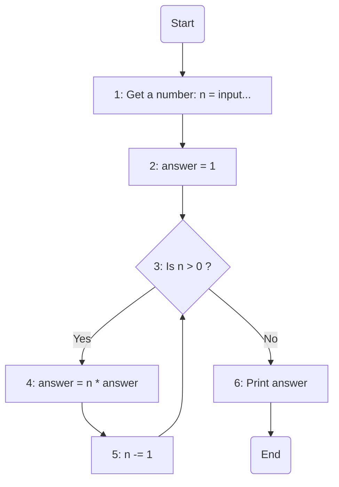

### راهنمای تمرین فاکتوریل

تو این تمرین ازتون خواسته شده که فرمول فاکتوریل رو که تو ریاضی خوندید بصورت برنامه پیاده سازی کنید.

فرمول کلی فاکتوریل:

> n! = n \* (n-1) \* (n-2) \* ... \* 1

برای مثال:

> 4! = 4 \* 3 \* 2 \* 1  
> 85! = 85 \* 84 \* .. \* 3 \* 2 \* 1

پایین راهنما های الگوریتمی و فلوچارتی براتون آورده شده. ولی اگه حس میکنید بدون نیاز به خوندن هرکودوم میتونید باقی مساله رو حل کنید شروع به کد زدن کنید.

### الگوریتم

**مقداردهی اولیه n**: عددی که میخاید فاکتوریل اون رو حساب کنید از کاربر بگیرید.  
**مقداردهی اولیه answer**: یک متغیر به اسم جواب (answer) با مقدار اولیه 1 تعریف میکنیم که جواب نهایی فاکتوریل توش ذخیره میشه.  
**حلقه**: تا وقتی که مقدار n > 0 باشه مراحل زیر انجام میشه:

> مقدار answer در n ضرب میشه.  
> مقدار n رو یکی کم می کنیم.

**توقف**: وقتی مقدار n برابر با صفر شد، حلقه متوقف شده و مقدار نهایی answer برابر با فاکتوریل عدد ورودی خواهد بود.  
**نمایش نتیجه**: مقدار answer چاپ شده و برنامه خاتمه می‌یابد.

### فلوچارت

### تعقیب

برای درک بهتر فلوچارت بالا با توجه به مرحله هاش متغیرها (variables) رو با مثال 4 فاکتوریل تعقیب میکنیم

> میتونید کدتون رو توی [این سایت](https://pythontutor.com/render.html#mode=edit) بزنید که براتون تعقیب رو خودش انجام بده و شما ببینید.

| مرحله    | Start | 1   | 2   |     | 3   | 4   | 5   |     | 3   | 4   | 5   |     | 3   | 4   | 5   |     | 3   | 4   | 5   |     | 3   | 6   | End    |
| -------- | ----- | --- | --- | --- | --- | --- | --- | --- | --- | --- | --- | --- | --- | --- | --- | --- | --- | --- | --- | --- | --- | --- | ------ |
| `n`      | -     | 4   | 4   |     | 4   | 4   | 3   |     | 3   | 3   | 2   |     | 2   | 2   | 1   |     | 1   | 1   | 0   |     | 0   | 0   | 0      |
| `answer` | -     | -   | 1   |     | 1   | 4   | 4   |     | 4   | 12  | 12  |     | 12  | 24  | 24  |     | 24  | 24  | 24  |     | 24  | 24  | **24** |
