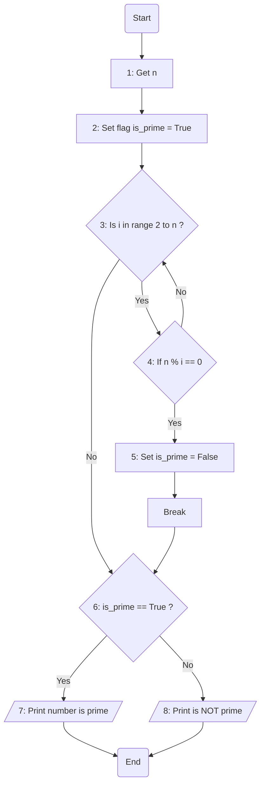

### 💡 راهنمای تمرین عدد اول

تو این تمرین شما باید متوجه بشید که آیا یک عدد اول هست یا نه؟

اعداد اول اعدادی هستن که بر هیچ عددی جز خودشون و عدد یک بخش پذیر نباشن

> برای مثال ۲، ۳، ۵، ۷، ۱۱ و ... اعداد اول هستن

طبق معمول عدد n رو از کاربر میگیریم و چون با 1 و خود n کاری نداریم  
برای همین ما از ۲ شروع میکنیم و تا یک عدد قبل n رو بررسی میکنیم  
اگر در این میون عددی به چشممون خورد که n بهش بخش پذیر بود  
متوجه میشیم n کلا ناامیدمون کرده و عدد اول نیست

### ✅ ارسال تمرین

لطفا اسکرین شات تمرین هاتون رو به [این لینک](https://github.com/hayyaun/kids/discussions/4) بفرستید.  
زیرش اسمتون و شماره تمرین رو هم کامنت کنید.

### 🧠 الگوریتم

**گرفتن عدد n**: ابتدا عدد n رو از کاربر میگیریم

**بالا بردن پرچم 🏳️:** ما با این آرزو که این عدد اول هست پرچم is_prime رو بالا میبریم یعنی اعتقاد داریم که عدد مورد بررسی حتما اول هست. (مگر اینکه خلافش ثابت شه که پرچم رو اگه نباشه پایین میاریم)

**حلقه**: در این حلقه میگردیم دنبال اینکه ببینیم عدد مورد بررسی n بر عددی قبل از خودش بخش پذیره یا نه؟

> **در صورتی که بخش پذیر نبود:** به پرچم دست نمیزنیم و ادامه میدیم  
> **ولی در صورتی که بخش پذیر بود:** این عدد طبق حدس ما عدد اول نبوده و آرزوهامون نابود شد پس پرچم رو پایین میاریم! 🏴

**نمایش عدد اول**: در انتها توی حلقه بزرگ اعدادی که اول هستند رو نمایش میدیم

### 🔀 فلوچارت

### 👣 تعقیب

برای درک بهتر فلوچارت بالا با توجه به مرحله هاش متغیرها (variables) رو تعقیب میکنیم.  
توی این مثال کاربر ما عدد 21 رو میخاد بررسی کنه ببینه اول هست یا نه:

> n = 21

| مرحله         | Start | 1   | 2    |     | 3    | 4    |     | 3    | 4    | 5     | 6          | 8       | End       |
| ------------- | ----- | --- | ---- | --- | ---- | ---- | --- | ---- | ---- | ----- | ---------- | ------- | --------- |
| `is_prime` 🏳️ | -     | -   | True |     | True | True |     | True | True | False | False 😭🏴 | `False` | **False** |
| `i`           | -     | -   | -    |     | 2    | 2    |     | 3    | 3    | 3     | -          | -       | -         |
