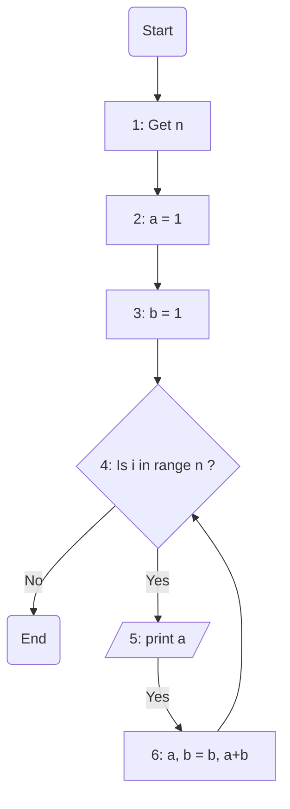

### 💡 راهنمای تمرین سری فیبوناچی

دنباله یا سری فیبوناچی به اعدادی میگن که پشت سر هم نوشته میشن و هرعدد جمع دو عدد قبلی خودشه  
برای مثال این یک دنبال فیبوناچی هست که با اعداد 1 و 1 شروع میشه:

> 1 - 1 - 2 - 3 - 5 - 8 - 13 - 21 - ...

> فرض کنید پای چپتون درد میکنه و پای راستتون رو جلو میذارید و پای چپتون رو میکشید جلو  
> با این کار پای راست شما اسمش میشه پای b و پای چپتون میشه اسمش  
> همیشه پای راستتون جلوتر از عقبی هست و پای چپتون همیشه عقب تره  
> وقتی میکشیدش جلو تازه میاد جایی که پای b قبلا بوده

### ✅ ارسال تمرین

لطفا اسکرین شات تمرین هاتون رو به [این لینک](https://github.com/hayyaun/kids/discussions/4) بفرستید.  
زیرش اسمتون و شماره تمرین رو هم کامنت کنید.

### 🧠 الگوریتم

برای اینکه بدونیم چندتا عدد باید نشون بدیم، از کاربر دوباره اون n رو میخایم  
دو تا عدد شروع کننده رو که همون دوتا یک هستن نامگذاری میکنیم a , b مثلا  
حالا میایم یه مقدار یه حلقه درست میکنیم که n بار کار زیر رو برامون تکرار کنه:

اول مقدار a رو نمایش میدیم  
بعد وقتش میرسه که a رو ببریم جایی که b هست و b رو مساوی a+b کنیم

> اما مشکلی که هست اینه:  
> اگه ما a رو اول تغییر بدیم دیگه چجوری b رو برابر a+b کنیم؟  
> چون a شده b و انگار داریم b رو فقط اینجوری دوبرابر میکنیم (b+b)  
> اگه b رو هم اول تغییر بدیم بکنیم a + b هم بعدش چجوری مقدار قبل b رو که گم شده بریزیم توی a؟
>
> > روش انجام این کار رو توی درسای بعدی میخونیم... اما... این انتهای ماجرا نیست!

خبر خوب اینکه پایتون کارمون رو راحت کرده و بهمون اجازه میده بدون دغدغه همزمان تغییرشون بدیم:

> a, b = b, a + b

و تمام... شما با موفقیت دنباله فیبوناچی رو نوشتید

### 🔀 فلوچارت

### 👣 تعقیب

برای درک بهتر فلوچارت بالا. مثال عدد ورودی n=5 رو پیاده سازی و تعقیب میکنیم

| مرحله | Start | 1   | 2   | 3   |     | 4   | 5   | 6   |     | 4   | 5   | 6   |     | 4   | 5   | 6   |     | 4   | 5   | 6   |     | 4   | 5   | 6   |     | 4   | End |
| ----- | ----- | --- | --- | --- | --- | --- | --- | --- | --- | --- | --- | --- | --- | --- | --- | --- | --- | --- | --- | --- | --- | --- | --- | --- | --- | --- | --- |
| `i`   | -     | -   | -   | -   |     | 0   | 0   | 0   |     | 1   | 1   | 1   |     | 2   | 2   | 2   |     | 3   | 3   | 3   |     | 4   | 4   | 4   |     | 5   | -   |
| `a`   | -     | -   | 1   | 1   |     | 1   | `1` | 1   |     | 1   | `1` | 2   |     | 2   | `2` | 3   |     | 3   | `3` | 5   |     | 5   | `5` | 8   |     | 8   | 8   |
| `b`   | -     | -   | -   | 1   |     | 1   | 1   | 2   |     | 2   | 2   | 3   |     | 3   | 3   | 5   |     | 5   | 5   | 8   |     | 8   | 8   | 13  |     | 13  | 13  |

مقادیر رنگی شده اونایی هستن که پرینت میشن... همونجوری که می بینید به ترتیب برنامه با خوندن کد ما این مقادیر رو ینی `1 - 1 - 2 - 3- 5` رو پرینت میکنه
