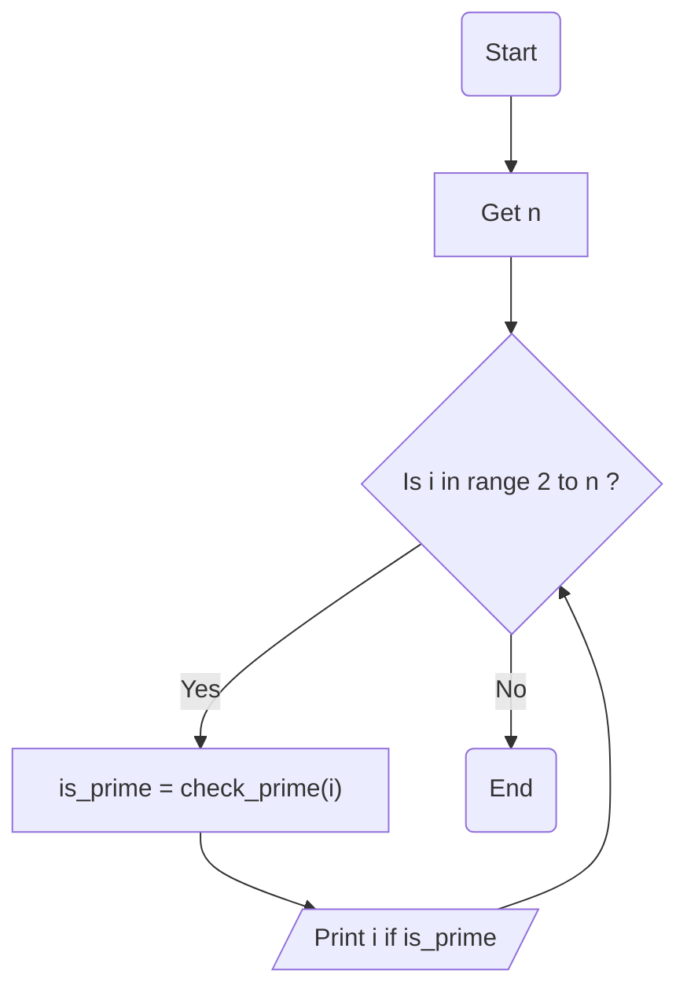

### 💡 راهنمای تمرین اعداد اول

این تمرین دقیقا مثل تمرین اعداد اوله با این تفاوت که این بار یه عدد از کاربر میگیریم  
و میگردیم ببینیم چه اعدادی اولی بین صفر تا عددی که از کاربر گرفته شده وجود دارند  
برای این کار ما کد تمرینی که برای فهمیدن یک عدد اول داشتیم رو داخل یه تابع تعریف می کنیم  
بعد با یه حلقه ساده میگردیم میبینیم کودوم عدد ها کمتر از n هستن که که عدد اول هستن  
و فقط همونارو نمایش میدیم...

### ✅ ارسال تمرین

لطفا اسکرین شات تمرین هاتون رو به [این لینک](https://github.com/hayyaun/kids/discussions/4) بفرستید.  
زیرش اسمتون و شماره تمرین رو هم کامنت کنید.

### 🧠 الگوریتم

**گرفتن عدد n**: ابتدا عدد n رو از کاربر میگیریم

**ساخت تابع**: کدی که در تمرین عدد اول زدیم رو میاریم داخل این تابع و مقدار is_prime رو برمیگردونیم (return)

**حلقه بزرگ**: در حلقه بزرگ ما از اعداد ۲ تا n به دنبال هر عدد اول میگردیم

> **بررسی اول بودن**: بررسی اینکه عدد اول هست یا نه به کمک تابع check_prime(i) که ساختیم  
> **نمایش عدد اول**: در انتها در حلقه بزرگ اعدادی که اول هستند رو نمایش میدیم

### 🔀 فلوچارت

