```mermaid
flowchart TD
 subgraph s1["Algorithm 2"]
        n7["Start"]
        n8["a = input ..."]
        n9["b = input ..."]
        n10["print a , b"]
        n11["a = a + b"]
        n12["b = a - b"]
        n13["a = a - b"]
        n14["print a , b"]
        n15["End"]
      end
 subgraph s2["Algorith, 1"]
        A("Start")
        C["a = input ..."]
        n1["b = input ..."]
        n6["print a , b"]
        n3["a = b"]
        n2["c = a"]
        n4["b = c"]
        n5["print a , b"]
        L("End")
  end
    A --> C
    C --> n1
    n1 --> n6
    n2 --> n3
    n3 --> n4
    n4 --> n5
    n6 --> n2
    n5 --> L
    n7 --> n8
    n8 --> n9
    n9 --> n10
    n10 --> n11
    n11 --> n12
    n12 --> n13
    n13 --> n14
    n14 --> n15

    n7@{ shape: event}
    n1@{ shape: proc}
```

### راهنمای تمرین جابجایی

توی این تمرین ازتون میخام که تابعی بنویسید که مقادیر a و b رو دریافت کنه و با هم جابجاشون کنه  
مقدار قبل و بعد از جابجایی رو هم به کاربر نشون بدید.

در نهایت هم: سه بار این تابع رو با سه مقدار مختلف فراخوانی کنید تا مطمئن شید درست کار میکنه!

> برای حلش دوتا راه حل دارید که اولی آسون و دومی سخته... خودتون انتخاب کنید

### ارسال تمرین

لطفا اسکرین شات تمرین هاتون رو به [این لینک](https://github.com/hayyaun/kids/discussions/4) بفرستید.  
زیرش اسمتون و شماره تمرین رو هم کامنت کنید.

### الگوریتم

دو راه حل برای حل این مساله وجود داره که بصورت فلوچارت براتون پایین کشیدم  
**راه حل اول**: جابجایی با استفاده از متغیر موقت  
**راه حل دوم**: جابجایی با استفاده از عملیات ریاضی

> **توضیح راه حل اول**:  
> مقدار a رو داخل متغیر موقت c میریزیم  
> حالا با خیال راحت مقدار a رو تغییر میدیم میکنیم b  
> مقدار b رو برابر c قرار میدیم چون مقدار a قدیم داخل c هست  
> الان مقدار b برابر a قدیم و مقدار a برابر با b قدیم شده! تمام!

> **توضیح راه حل دوم**:  
> میدونم این گیج کننده ترن چیزیه که دیدید  
> ولی میخام واستون خیلی خیلی ساده ش کنم  
> خب فرض کنید ما الان a = 3 داریم و b = 5
>
> مقدار a + b رو میریزیم توی a و ازین به بعد a2 صداش میکنیم
>
> **`a2 = a + b`**
>
> حالا میخایم مقدار اولیه a رو از a2 در بیاریم و بریزیم توی b
>
> **`b2 = a2 - b`** = (a + b) - b = a
>
> حالا که b مقدار اولیه a رو گرفته وقتشه به a هم مقدار اولیه b رو بدیم
>
> **`a3 = a2 - b2`** = (a + b) - (a + b - b) = (a + b) - a = b
>
> کد نهایی به این شکل میشه:
>
> ```python
>   a = a + b
>   b = a - b
>   a = a - b
> ```

### فلوچارت


