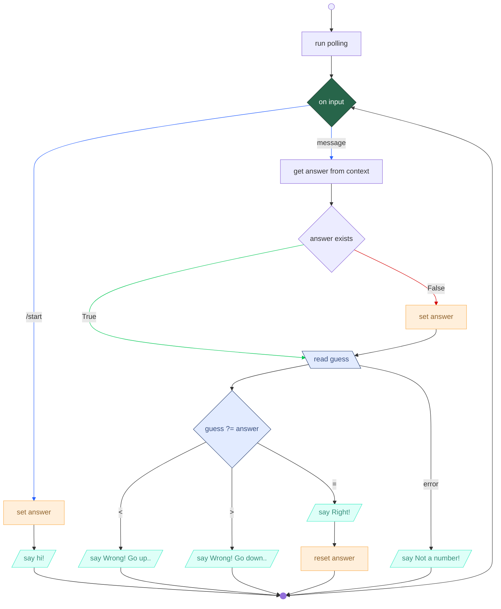

```mermaid
flowchart TD
    n1["Untitled Node"] --> n2["run polling"]
    n2 --> n3["on input"]
    n6["set answer"] --> n7["say hi!"]
    n7 --> n18["send"]
    n8["get answer from context"] --> n9["answer exists"]
    n9 -- False --> n10["set answer"]
    n9 -- True --> n11["read guess"]
    n11 -- error --> n12["say Not a number!"]
    n11 --> n13["guess ?= answer"]
    n13 -- "=" --> n14["say Right!"]
    n13 -- &gt; --> n15["say Wrong! Go down.."]
    n13 -- &lt; --> n16["say Wrong! Go up.."]
    n14 --> n17["reset answer"]
    n16 --> n18
    n15 --> n18
    n17 --> n18
    n18 --> n3
    n12 --> n18
    n10 --> n11
    n3 -- /start --> n6
    n3 -- message --> n8

    n1@{ shape: start}
    n2@{ shape: proc}
    n3@{ shape: decision}
    n6@{ shape: proc}
    n7@{ shape: in-out}
    n18@{ shape: junction}
    n8@{ shape: proc}
    n9@{ shape: decision}
    n11@{ shape: out-in}
    n12@{ shape: in-out}
    n13@{ shape: decision}
    n14@{ shape: in-out}
    n15@{ shape: in-out}
    n16@{ shape: in-out}
     n3:::Pine
     n6:::Peach
     n7:::Aqua
     n10:::Peach
     n11:::Sky
     n12:::Aqua
     n13:::Sky
     n14:::Aqua
     n15:::Aqua
     n16:::Aqua
     n17:::Peach
    classDef Pine stroke-width:1px, stroke-dasharray:none, stroke:#254336, fill:#27654A, color:#FFFFFF
    classDef Peach stroke-width:1px, stroke-dasharray:none, stroke:#FBB35A, fill:#FFEFDB, color:#8F632D
    classDef Aqua stroke-width:1px, stroke-dasharray:none, stroke:#46EDC8, fill:#DEFFF8, color:#378E7A
    classDef Sky stroke-width:1px, stroke-dasharray:none, stroke:#374D7C, fill:#E2EBFF, color:#374D7C
    linkStyle 5 stroke:#D50000,fill:none
    linkStyle 6 stroke:#00C853,fill:none
    linkStyle 16 stroke:#424242
    linkStyle 19 stroke:#2962FF,fill:none
    linkStyle 20 stroke:#2962FF,fill:none


```
