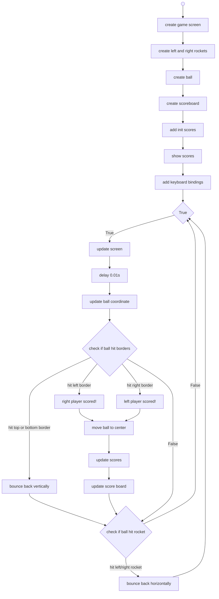

Game Project for this course

Below is the flowchart of the game:

```mermaid
flowchart TD
    n1["Untitled Node"] --> n2["create game screen"]
    n2 --> n4["create left and right rockets"]
    n4 --> n3["create ball<br>"]
    n3 --> n5["create scoreboard"]
    n5 --> n6["add init scores"]
    n6 --> n7["show scores"]
    n7 --> n8["add keyboard bindings"]
    n8 --> n9["True"]
    n9 -- True --> n10["update screen"]
    n10 --> n11["delay 0.01s"]
    n11 --> n12["update ball coordinate"]
    n12 --> n13["check if ball hit borders"]
    n13 -- hit right border --> n17["left player scored!"]
    n13 -- hit top or bottom border --> n15["bounce back vertically"]
    n13 -- hit left border --> n16["right player scored!"]
    n16 --> n19["move ball to center"]
    n17 --> n19
    n14["check if ball hit rocket"] -- hit left/right rocket --> n18["bounce back horizontally"]
    n19 --> n20["update scores"]
    n15 --> n14
    n20 --> n21["update score board"]
    n21 --> n14
    n18 --> n9
    n14 -- False --> n9
    n13 -- False --> n14

    n1@{ shape: start}
    n2@{ shape: proc}
    n4@{ shape: proc}
    n3@{ shape: proc}
    n5@{ shape: proc}
    n6@{ shape: proc}
    n7@{ shape: proc}
    n8@{ shape: proc}
    n9@{ shape: decision}
    n13@{ shape: decision}
    n14@{ shape: decision}
```
